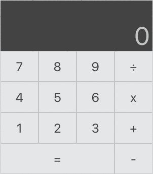
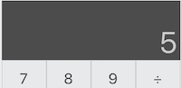
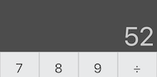
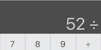
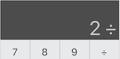
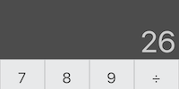

# Calculator / React + Redux app

Una calculadora simple implementada con React + Redux usando [`create-react-app`](https://github.com/facebook/create-react-app).




## Descripción del ejercicio
Esta aplicación contiene todos los componentes y las definición de las acciones para tener una calculadora funcional, sin embargo, la lógica está incompleta. Su tarea es implementar la lógica restante para renderizar los componentes apropiadamente (como lo muestra el gif) y usar las acciones para ejecutar cada operación.

### ***Para ejecutar la aplicación y ejecutar las pruebas unitarias vaya al final de este README.***

### Condiciones

- La calculadora debe ejecutar apropiadamente las operaciones `suma`, `resta`, `división` y `multiplicación`
- Todas las operaciones deben ser realizadas usando las acciones y reductores de [Redux](https://es.redux.js.org/)
- Si ninguna operación ha sido seleccionada todos los números que se seleccionen corresponden al primer operando
- Si una operación ha sido seleccionada todos los números que se seleccionen corresponden al segundo operando
- Cuando una operación se ha seleccionado el símbolo de la operación debe aparecer al lado de la cifra
- Al presionar igual (`=`) se debe ejecutar la correspondiente operación y mostrarse el resultado
- Los operandos y la operación se deben reiniciar despues de haber ejecutado la operación
- Solo se ejecuta una operación a la vez. No se requiere implementar concatenación de operadores del tipo `5 * 3 / 5`
- La calculadora no require implementar manejo de decimales, ni excepciones numéricas. No es requerido el símbolo punto (`.`) ni el cero (`0`)
- No es necesario soportar el ingreso de los dígitos a través del teclado
- Todas las pruebas unitarias deben ejecutarse correctamente
- Agregue las pruebas unitarias que considere necesarias
- Al final publique el código en algún repositorio público Github, Gitlab o Bitbucket
- El ejercicio debe ser completado antes de la validación técnica. Si no logra completar el ejercicio se evaluará basado en lo que haya avanzado.

**NOTA: se permite aplicar cualquier mejora a nivel de implementación, estilos, librerías, pruebas unitarias y lo que considere necesario para demostrar su conocimiento y experiencia siempre y cuando se respeten las condiciones mencionadas.**

### Ejemplo

1. El usuario hace clic en el número `5`, la calculadora muestra `5`

    

2. El usuario hace clic en el número `2`, la calculadora muestra `52`

    

3. El usuario hace clic en la operación división (`÷`), la calcula muestra `52 ÷`

    

4. El usuario hace clic en el número `2`, la calculadora muestra `2 ÷`

    

5. El usuario hace clic en el botón igual (`=`), la calculadora muestra `26`

    

6. El usuario hace clic en el número 5, `VUELVE AL PASO 1`.

## Pasos para ejecutar la aplicación

  1. Clone el repositorio

      ```bash
      git clone git@github.com:ndiaz-candido/react-simple-calculator.git
      ```

  2. Instale las dependencias

      ```bash
      npm install
      ```

  3. Ejecutar la aplicación en modo `dev`

      ```bash
      npm start
      ```

## Para ejecutar los unit tests

Las pruebas unitarias están escritas usando [Jest](https://jestjs.io/en/)

```bash
npm test
```
